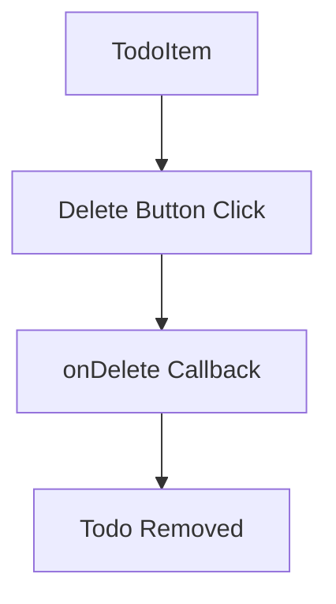
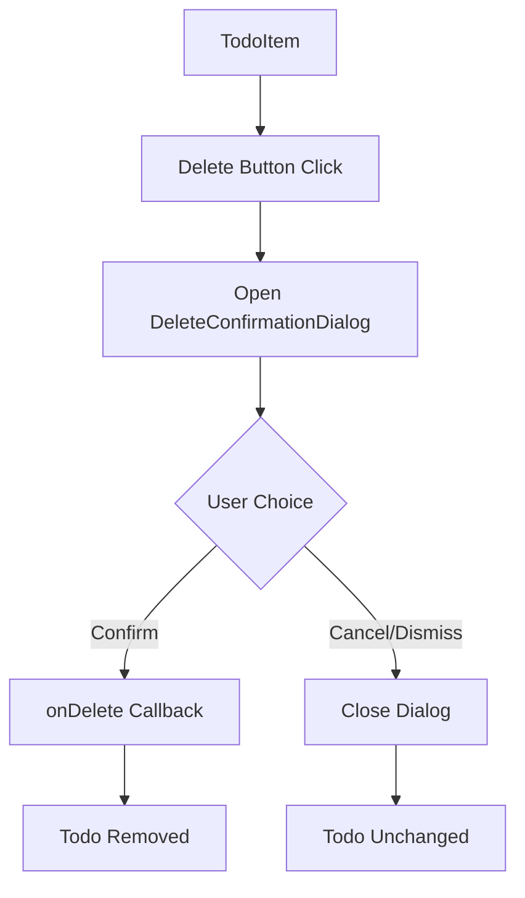

# Design Document: Delete Confirmation Dialog

## Overview

This design document outlines the approach for adding a delete confirmation dialog to the Todo application. When a user clicks the delete button on a todo item, a confirmation dialog will appear asking if they're sure they want to delete the item. This prevents accidental deletions and provides a better user experience.

The implementation will leverage the existing Radix UI Dialog primitives already available in `src/components/ui/dialog.tsx`, ensuring accessibility compliance and consistent styling with the app's comic-style design.

## Architecture

### Current Delete Flow



### New Delete Flow with Confirmation



The new architecture adds a confirmation step between the delete button click and the actual deletion:
- `TodoItem` manages dialog open/close state
- `DeleteConfirmationDialog` displays the confirmation UI
- Confirmation triggers the existing `onDelete` callback
- Cancel/dismiss closes the dialog without side effects

## Components and Interfaces

### DeleteConfirmationDialog Component

A new component that wraps the existing Dialog primitives to provide delete confirmation functionality.

```typescript
interface DeleteConfirmationDialogProps {
  open: boolean;
  onOpenChange: (open: boolean) => void;
  todoText: string;
  onConfirm: () => void;
}

function DeleteConfirmationDialog({
  open,
  onOpenChange,
  todoText,
  onConfirm,
}: DeleteConfirmationDialogProps): JSX.Element {
  const handleConfirm = () => {
    onConfirm();
    onOpenChange(false);
  };

  return (
    <Dialog open={open} onOpenChange={onOpenChange}>
      <DialogContent>
        <DialogHeader>
          <DialogTitle>Delete Todo?</DialogTitle>
          <DialogDescription>
            Are you sure you want to delete "{todoText}"?
          </DialogDescription>
        </DialogHeader>
        <DialogFooter>
          <Button variant="outline" onClick={() => onOpenChange(false)}>
            Cancel
          </Button>
          <Button variant="destructive" onClick={handleConfirm}>
            Delete
          </Button>
        </DialogFooter>
      </DialogContent>
    </Dialog>
  );
}
```

### Props Interface

| Prop | Type | Description |
|------|------|-------------|
| `open` | `boolean` | Controls dialog visibility |
| `onOpenChange` | `(open: boolean) => void` | Callback when dialog open state changes |
| `todoText` | `string` | The text of the todo being deleted (displayed in dialog) |
| `onConfirm` | `() => void` | Callback invoked when user confirms deletion |

### TodoItem Updates

The `TodoItem` component will be updated to manage dialog state:

```typescript
function TodoItem({ todo, onComplete, onDelete }: TodoItemProps) {
  const [showDeleteDialog, setShowDeleteDialog] = useState(false);

  const handleDeleteClick = () => {
    setShowDeleteDialog(true);
  };

  const handleConfirmDelete = () => {
    onDelete(todo.id);
  };

  return (
    <motion.div /* existing props */>
      {/* existing content */}
      
      <Button onClick={handleDeleteClick}>
        <Trash2 />
      </Button>

      <DeleteConfirmationDialog
        open={showDeleteDialog}
        onOpenChange={setShowDeleteDialog}
        todoText={todo.text}
        onConfirm={handleConfirmDelete}
      />
    </motion.div>
  );
}
```

### Button Variant Addition

A `destructive` variant will be added to the Button component for the confirm button:

```typescript
const buttonVariants = cva(/* existing */, {
  variants: {
    variant: {
      // existing variants...
      destructive: "bg-red-500 text-white border-black hover:bg-red-600",
    },
  },
});
```

## Data Models

### Component State

**TodoItem State:**
| State | Type | Description |
|-------|------|-------------|
| `showDeleteDialog` | `boolean` | Controls visibility of the delete confirmation dialog |

**DeleteConfirmationDialog State:**
The dialog component is controlled (stateless) - all state is managed by the parent via props.

### Props Flow

```
TodoItem
  ├── todo.text → passed to DeleteConfirmationDialog as todoText
  ├── todo.id → used in handleConfirmDelete callback
  ├── showDeleteDialog → passed as open prop
  ├── setShowDeleteDialog → passed as onOpenChange prop
  └── handleConfirmDelete → passed as onConfirm prop
        └── calls onDelete(todo.id)
```

### Accessibility Features (via Radix UI)

The existing Dialog primitives provide:
- Focus trap within dialog when open
- Focus restoration to trigger element on close
- Escape key to dismiss
- Click outside to dismiss
- Proper ARIA attributes (`role="dialog"`, `aria-modal`, `aria-labelledby`, `aria-describedby`)
- Screen reader announcements


## Correctness Properties

*A property is a characteristic or behavior that should hold true across all valid executions of a system—essentially, a formal statement about what the system should do. Properties serve as the bridge between human-readable specifications and machine-verifiable correctness guarantees.*

### Property 1: Delete Button Opens Dialog

*For any* TodoItem with a delete button, clicking the delete button SHALL result in the DeleteConfirmationDialog being open.

**Validates: Requirements 1.1**

### Property 2: Dialog Displays Todo Text

*For any* todo item with any text content, when the DeleteConfirmationDialog opens, the dialog SHALL contain that todo's text.

**Validates: Requirements 1.2**

### Property 3: Confirmation Triggers Deletion

*For any* open DeleteConfirmationDialog, clicking the Confirm button SHALL trigger the onDelete callback exactly once.

**Validates: Requirements 2.2**

### Property 4: Dismissal Does Not Trigger Deletion

*For any* open DeleteConfirmationDialog and any dismissal action (cancel button, escape key, click outside, close button), the onDelete callback SHALL NOT be called and the todo SHALL remain unchanged.

**Validates: Requirements 1.3, 3.2, 4.1, 4.2, 4.3**

### Property 5: Keyboard Activation

*For any* focused Confirm or Cancel button in the dialog, pressing Enter or Space SHALL trigger that button's action exactly once.

**Validates: Requirements 5.3**

### Property 6: Focus Restoration

*For any* DeleteConfirmationDialog that closes (via any method), focus SHALL return to the Delete button that originally triggered the dialog.

**Validates: Requirements 5.5**

## Error Handling

| Scenario | Handling |
|----------|----------|
| `onConfirm` called when dialog not open | No-op; dialog state prevents this |
| `todoText` is empty string | Display dialog with empty quotes; still functional |
| Multiple rapid confirm clicks | First click closes dialog; subsequent clicks have no target |
| Dialog opened for deleted todo | Parent component handles; dialog receives stale props |
| Escape pressed when no dialog open | No-op; Radix handles this |

The use of Radix UI Dialog primitives handles most edge cases automatically:
- Focus management and restoration
- Keyboard event handling
- Click outside detection
- Proper cleanup on unmount

## Testing Strategy

### Dual Testing Approach

Testing will use both unit tests and property-based tests for comprehensive coverage:

- **Unit tests**: Verify specific examples, edge cases, accessibility features, and visual styling
- **Property tests**: Verify universal properties across randomized inputs

### Unit Tests

Unit tests will cover:
1. Dialog opens when delete button is clicked
2. Dialog displays the correct todo text
3. Confirm button triggers onDelete and closes dialog
4. Cancel button closes dialog without triggering onDelete
5. Escape key closes dialog without triggering onDelete
6. Dialog has correct ARIA attributes
7. Confirm button has destructive styling
8. Theme support (light/dark mode classes)

### Property-Based Tests

Property-based tests will use `fast-check` library with minimum 100 iterations per test.

Each property test must be tagged with:
- **Feature: delete-confirmation, Property {number}: {property_text}**

Properties to implement as property-based tests:
1. **Property 2**: Dialog displays todo text - generate random todo text strings, verify they appear in dialog
2. **Property 4**: Dismissal does not trigger deletion - generate random dismissal sequences, verify onDelete never called

Note: Properties 1, 3, 5, 6 are better suited for unit tests as they test specific interactions rather than properties that benefit from randomized inputs.

### Test File Structure

```
src/__tests__/
├── DeleteConfirmationDialog.test.tsx    # Unit tests
└── properties/
    └── DeleteConfirmationDialog.property.test.tsx  # Property-based tests
```

### Test Configuration

- Test runner: Vitest with jsdom environment
- Property testing: fast-check library
- Component testing: @testing-library/react
- Minimum iterations for property tests: 100
