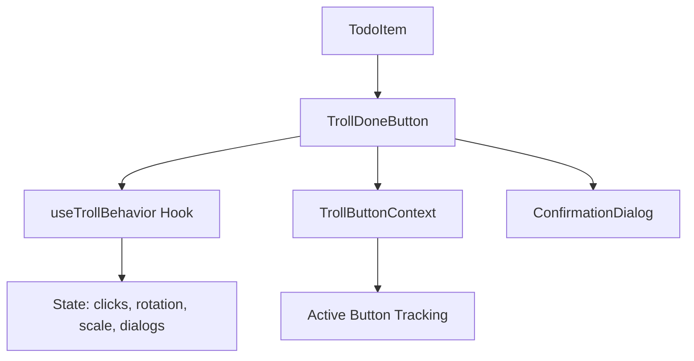
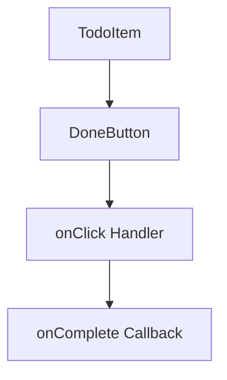

# Design Document: Fix Done Button

## Overview

This design document outlines the approach for replacing the intentionally broken "troll" Done button with a standard, user-friendly button component. The fix involves creating a new `DoneButton` component with straightforward behavior and removing all troll-related code from the codebase.

The current implementation uses several interconnected components:
- `TrollDoneButton` - The button with evasion and transformation behaviors
- `TrollButtonContext` - Context for coordinating which button is displaced
- `useTrollBehavior` - Hook managing all troll state (clicks, rotation, scale, dialogs)
- `ConfirmationDialog` - Dialog component for the escalating confirmation messages

The new implementation will be a simple `DoneButton` component that directly calls the completion callback on click.

## Architecture

### Current Architecture (To Be Removed)



### New Architecture



The new architecture is dramatically simpler:
- `DoneButton` receives `onComplete` and `isCompleted` props
- On click, it directly calls `onComplete`
- No intermediate state, no context, no dialogs

## Components and Interfaces

### DoneButton Component

The new `DoneButton` component replaces `TrollDoneButton` with standard behavior.

```typescript
interface DoneButtonProps {
  onComplete: () => void;
  isCompleted: boolean;
}

function DoneButton({ onComplete, isCompleted }: DoneButtonProps): JSX.Element | null {
  // Don't render if already completed
  if (isCompleted) {
    return null;
  }

  return (
    <Button
      variant="outline"
      size="default"
      onClick={onComplete}
      aria-label="Mark as complete"
      data-testid="done-button"
      className={/* styling */}
    >
      Done
    </Button>
  );
}
```

### Props Interface

| Prop | Type | Description |
|------|------|-------------|
| `onComplete` | `() => void` | Callback invoked when button is clicked |
| `isCompleted` | `boolean` | Whether the todo is already completed (hides button if true) |

### Styling

The button will use the existing comic-style design from the application:
- Yellow background (`bg-yellow-400`)
- Black border and text
- Bold shadow effect
- Hover and active state transitions
- Consistent with the app's visual language

## Data Models

### Component State

The new `DoneButton` is stateless - it receives all necessary data via props and has no internal state to manage.

**Removed State (from useTrollBehavior):**
- `clickCount` - No longer needed
- `rotation` - No longer needed
- `scale` - No longer needed
- `dialogStage` - No longer needed
- `hoverEscapeOffset` - No longer needed
- `escapeDirection` - No longer needed
- `escapeCount` - No longer needed

### Props Flow

```
TodoItem
  └── todo.id → used for onComplete callback
  └── todo.completed → passed as isCompleted
  └── onComplete(id) → wrapped and passed to DoneButton
```

## Correctness Properties

*A property is a characteristic or behavior that should hold true across all valid executions of a system—essentially, a formal statement about what the system should do. Properties serve as the bridge between human-readable specifications and machine-verifiable correctness guarantees.*

### Property 1: Single-Click Completion

*For any* DoneButton instance with `isCompleted=false`, clicking the button exactly once SHALL trigger the `onComplete` callback exactly once.

**Validates: Requirements 1.1, 1.2**

### Property 2: Position Stability on Hover

*For any* DoneButton instance, hovering over the button SHALL NOT change its position, transform, or translate properties from their initial values.

**Validates: Requirements 2.1, 2.2**

### Property 3: Size Consistency

*For any* DoneButton instance and any sequence of user interactions (clicks, hovers), the button's size and scale SHALL remain constant.

**Validates: Requirements 3.1, 3.2**

### Property 4: Rotation Consistency

*For any* DoneButton instance and any number of clicks, the button's rotation SHALL remain at its initial value (no rotation transformation applied).

**Validates: Requirements 3.3**

### Property 5: Visibility Matches Completion Status

*For any* todo item, the DoneButton SHALL be rendered if and only if `isCompleted=false`. When `isCompleted=true`, the button SHALL NOT be present in the DOM.

**Validates: Requirements 4.1, 4.2, 4.3**

### Property 6: Keyboard Activation

*For any* focused DoneButton instance, pressing Enter or Space SHALL trigger the `onComplete` callback exactly once.

**Validates: Requirements 5.3**

## Error Handling

The DoneButton component has minimal error scenarios due to its simple design:

| Scenario | Handling |
|----------|----------|
| `onComplete` is undefined | TypeScript will catch this at compile time (required prop) |
| `isCompleted` is undefined | TypeScript will catch this at compile time (required prop) |
| Multiple rapid clicks | Each click triggers callback; parent component handles idempotency |
| Button clicked after unmount | React handles cleanup; no special handling needed |

The simplicity of the new design eliminates most error conditions that existed in the troll implementation (dialog state errors, escape calculation errors, context provider missing, etc.).

## Testing Strategy

### Dual Testing Approach

Testing will use both unit tests and property-based tests for comprehensive coverage:

- **Unit tests**: Verify specific examples, edge cases, and accessibility features
- **Property tests**: Verify universal properties across randomized inputs

### Unit Tests

Unit tests will cover:
1. Button renders for incomplete todos
2. Button does not render for completed todos
3. Click triggers onComplete callback
4. Aria-label is present and correct
5. Button is keyboard focusable
6. No confirmation dialogs appear on click

### Property-Based Tests

Property-based tests will use `fast-check` library with minimum 100 iterations per test.

Each property test must be tagged with:
- **Feature: fix-done-button, Property {number}: {property_text}**

Properties to implement:
1. **Property 1**: Single-click completion - generate random button states, verify single click always triggers callback once
2. **Property 5**: Visibility matches completion status - generate random completion states, verify rendering matches

Note: Properties 2, 3, 4 (position, size, rotation stability) are best verified through unit tests checking CSS properties, as they don't benefit significantly from randomized inputs.

### Test File Structure

```
src/__tests__/
├── DoneButton.test.tsx           # Unit tests for new component
└── properties/
    └── DoneButton.property.test.tsx  # Property-based tests
```

### Test Configuration

- Test runner: Vitest with jsdom environment
- Property testing: fast-check library
- Component testing: @testing-library/react
- Minimum iterations for property tests: 100
